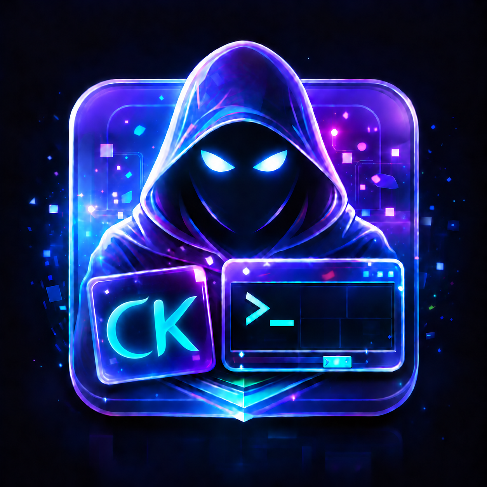

<p align="center">
  
</p>
<h1 align="center">ghost</h1>
<p align="center">A Tokyo Night desktop for Arch Linux and Hyprland.</p>

<p align="center">
  
  
  
  
  
  
</p>

---

**In development:** desktop configuration and theme assets are present. The Rust CLI parses arguments, but `install`, `apply`, `restore`, and `doctor` all return “not implemented yet.” A live VM session still needs validation.

## Overview

Ghost brings a consistent Tokyo Night appearance to Hyprland, Waybar, rofi, notifications, the dock, and the lock screen. It uses modular Lua configuration with per-host monitor and GPU settings. The supplied workstation profile targets a dual-monitor NVIDIA desktop; unknown hosts use automatic output configuration.

## Features

- **Floating dock:** translucent surface, rounded corners, blue hover highlight, autohide, and a rofi launcher button.
- **Keyboard workflow:** master/dwindle toggle, Vim-style window controls, workspace shortcuts, clipboard history, and annotated screenshots.
- **Desktop shell:** per-output Waybar, swaync notifications, PipeWire controls, and Dolphin integration.
- **Display profiles:** workstation and VM examples, with a generic fallback for other hosts.
- **OLED-conscious idle settings:** blank displays after ten minutes and lock after fifteen; no automatic suspend.
- **Theme assets:** Night and Storm palettes and wallpapers. The checked-in application colors use Night; automatic theme switching is planned.

## Quick start

To inspect and test the CLI with a Rust toolchain that supports the edition in [Cargo.toml](Cargo.toml):

```bash
git clone https://github.com/GhostKellz/ghost.git
cd ghost
cargo test --locked
cargo run --locked -- --help
```

To try the desktop, follow the [manual VM setup](docs/getting-started/installation.md). Building the CLI does not install the desktop. Use a dedicated test account and validate the compositor before adapting your main session.

## Configuration

| Change | Source |
|---|---|
| Displays and GPU selection | `config/hypr/hosts/` |
| Layout, gaps, borders, blur | `config/hypr/ghost/look.lua` |
| Keyboard and mouse bindings | `config/hypr/ghost/binds.lua` |
| Startup programs and dock arguments | `config/hypr/ghost/autostart.lua` |
| Dock opacity and hover styling | `config/nwg-dock-hyprland/style.css` |
| Theme colors | `themes/*/palette.toml` and application color files |
| Desktop dependencies | `packages/hyprland.txt` |

See [configuration](docs/getting-started/configuration.md), [themes and dock](docs/guides/themes-and-dock.md), and the [keybindings](docs/reference/keybindings.md).

## Project structure

```text
src/          Rust CLI parser and command skeleton
config/       Hyprland and desktop application configuration
packages/     Arch desktop package manifest
system/       Optional host-specific udev rule
themes/       Tokyo Night palette definitions
wallpapers/   Bundled artwork and its license
docs/         Setup, guides, reference, and architecture
```

The desktop currently loads configuration files directly. The CLI does not deploy or generate them. See the [architecture](docs/internals/architecture.md) for the current runtime flow.

## Documentation

Start with the [documentation index](docs/README.md). The [roadmap](docs/development/roadmap.md) separates implemented files from planned work.

## Contributing

See [CONTRIBUTING.md](CONTRIBUTING.md) for formatting, tests, and Conventional Commits. Changes are recorded in [CHANGELOG.md](CHANGELOG.md).

## Security

Report vulnerabilities privately using [SECURITY.md](SECURITY.md). Dependency decisions live in [advisories](docs/advisories/triage.md).

## License

Project code is [MIT licensed](LICENSE). Palette comments identify their upstream source.
