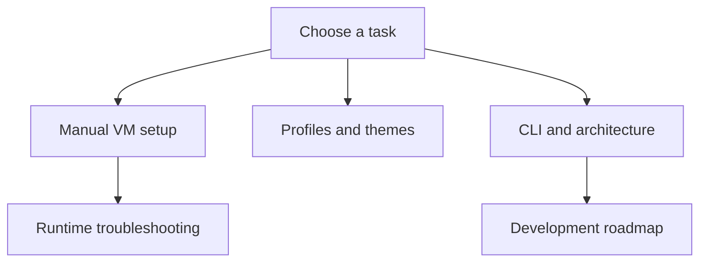

# Ghost documentation

Setup and reference for the Ghost desktop configuration and its Rust CLI.

## Getting started

- [Manual installation](getting-started/installation.md) — prerequisites, test-account deployment, validation, and rollback.
- [Configuration](getting-started/configuration.md) — host selection, monitors, GPU assumptions, and file locations.
- [Building and checks](getting-started/building.md) — Rust and static configuration checks.

## Guides and reference

- [Themes and dock](guides/themes-and-dock.md) — translucency, blur, colors, and wallpaper paths.
- [Login screen](guides/login-screen.md) — SDDM theme preview, installation, activation, and rollback.
- [Troubleshooting](guides/troubleshooting.md) — runtime diagnostics and VM acceptance checks.
- [Keybindings](reference/keybindings.md) — keyboard and mouse controls.
- [CLI](reference/cli.md) — accepted arguments and current failure behavior.

## Internals and development

- [Architecture](internals/architecture.md) — Lua startup and the separate CLI flow.
- [Roadmap](development/roadmap.md) — current implementation and next milestones.
- [Contributing](../CONTRIBUTING.md) — development workflow.
- [Changelog](../CHANGELOG.md) — recorded project changes.

## Security and dependencies

- [Security policy](../SECURITY.md) — private reporting and privilege boundaries.
- [Advisory triage](advisories/triage.md) — review process.
- [Dependency inventory](advisories/dependencies.md) — Rust and desktop dependency sources.
- [Accepted advisories](advisories/accepted.md) — documented risk decisions.
- [Resolved advisories](advisories/resolved.md) — remediation evidence.

## Quick reference

| Task | Command |
|---|---|
| Inspect CLI | `cargo run --locked -- --help` |
| Test CLI | `cargo test --locked` |
| Inspect displays, inside Hyprland | `hyprctl monitors` |
| Inspect configuration errors | `hyprctl configerrors` |
| Inspect window classes / layer namespaces | `hyprctl clients` / `hyprctl layers` |
