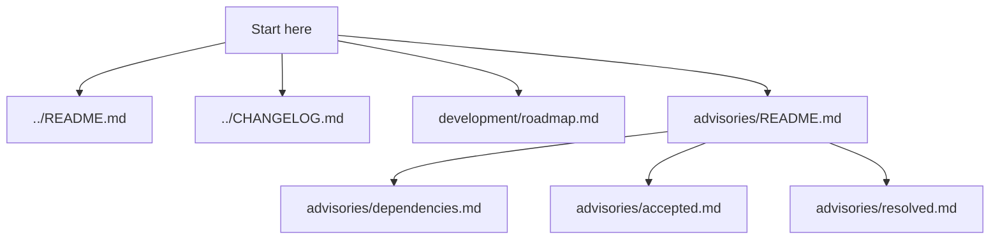

# ghost Documentation

👻 Ghost — a customized Hyprland desktop for Arch Linux, with cohesive themes and a Rust-powered installer.

## Documentation Map



## Current Surface

- Early repository scaffold
- Language-specific initialization
- Standard security, contributing, license, and advisory files

## Directory Structure

```text
docs/
├── README.md
├── advisories/
│   ├── README.md
│   ├── dependencies.md
│   ├── accepted.md
│   └── resolved.md
└── development/
    └── roadmap.md
```

## Conventions

- One concept per page.
- Filenames are lowercase and hyphenated.
- Mermaid diagrams are used where they clarify structure or flow.
- Docs should describe implemented behavior; planned work should be labeled.
