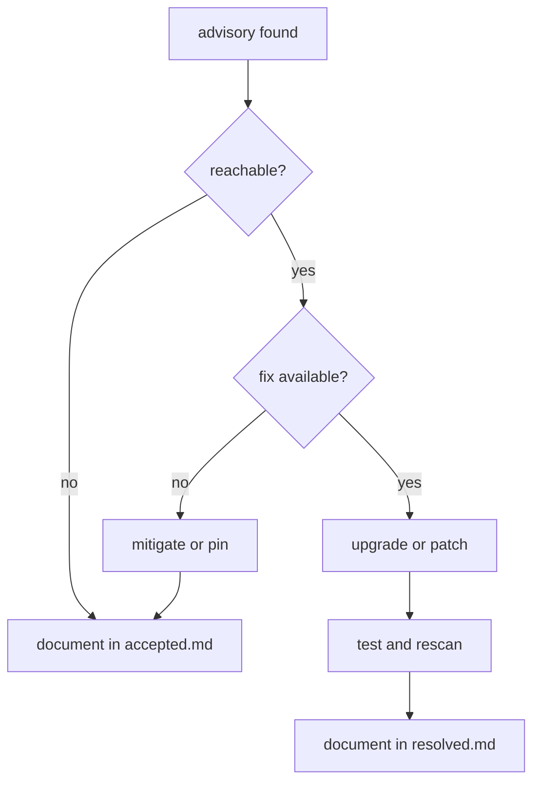

# Advisories

This section tracks dependency and security advisory decisions.

## Contents

- [Dependencies](dependencies.md)
- [Accepted](accepted.md)
- [Resolved](resolved.md)

## Triage Workflow

