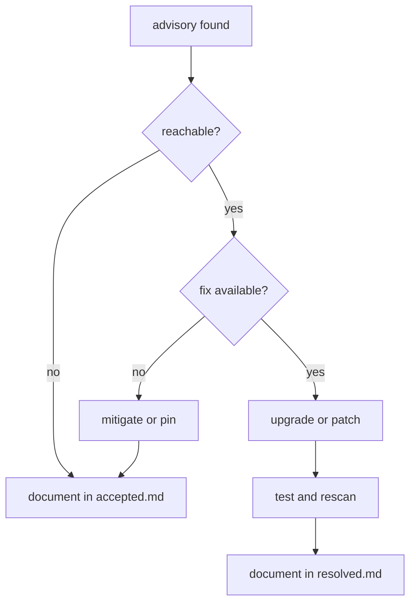

# Advisory triage

This section tracks dependency and security advisory decisions.

Run `cargo audit` with a current advisory database when available, then use
`cargo tree --locked` to trace affected dependencies. Record the scan date and
actual output when making a decision. No advisory scan has been recorded yet. A lack of recorded advisories does not establish
that dependencies are vulnerability-free.

## Contents

- [Dependencies](dependencies.md)
- [Accepted](accepted.md)
- [Resolved](resolved.md)

## Triage Workflow

