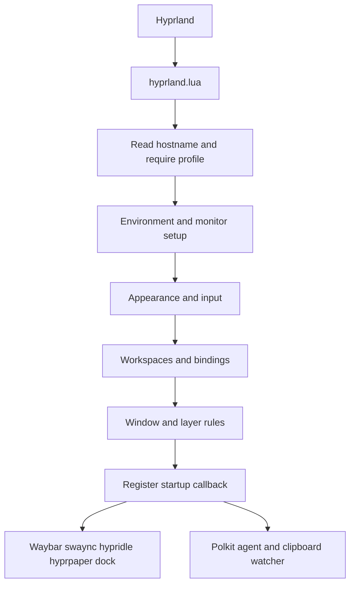
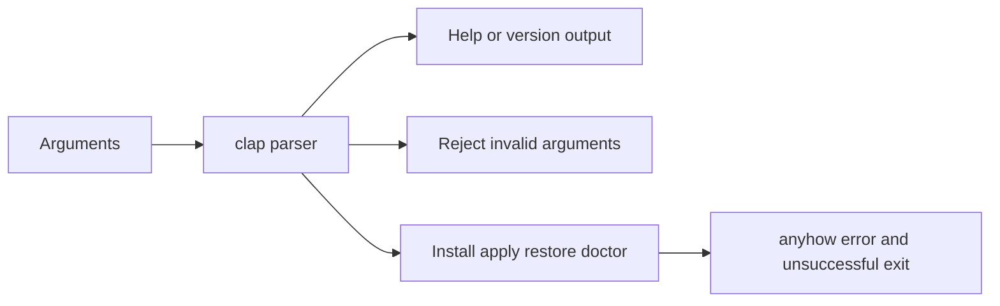

# Architecture

Ghost currently has two separate execution paths: a desktop loading static configuration, and a Rust command parser that reports unimplemented operations.

## Desktop startup

`hyprland.lua` runs each module as a separate step inside a protected call. A failing step is reported with a Hyprland error notification (`ghost/report.lua`) and the remaining steps still run, so a broken rules file does not remove keybindings or startup programs. If the host loader itself fails, the entry point reports it and loads `hosts/default.lua` directly; only if that also fails do later steps receive an empty profile (no monitors, no environment overrides). If keybindings fail, minimal emergency binds are registered (terminal, launcher, exit). Errors raised while Hyprland loads a module body are additionally listed by Hyprland's own config-error reporting (`hyprctl configerrors`).

Fallbacks are reported, not silent: a host profile that exists but fails to load produces an error notification before `hosts/default.lua` is used, and a missing or failing `split-monitor-workspaces` package produces a warning or error before native workspace selectors are used. A machine with no profile file uses the default profile without a message.

The compositor starts applications, and each application reads its own configuration. The palette TOML files are source assets for a future generator, not a live shared theme service. GTK CSS imports adjacent color files, rofi imports its Rasi colors, and the compositor loads a Lua palette.

## CLI boundary

There are no package-manager calls, deployment writes, backup operations, or theme rendering in the CLI. This boundary matters: flags describe a proposed interface, while the only implemented behavior is parsing and failure.

## Files and privileges

Desktop configuration and assets live in the user's home directory after manual copying. The optional udev rule belongs to system administration and is not applied by Lua. Package installation also requires administrative privileges. The future installer must separate privileged package/system actions from user-owned config and backup operations.

See [configuration](../getting-started/configuration.md) for host assumptions and [roadmap](../development/roadmap.md) for planned implementation.
