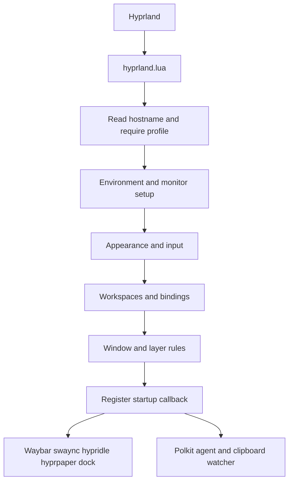
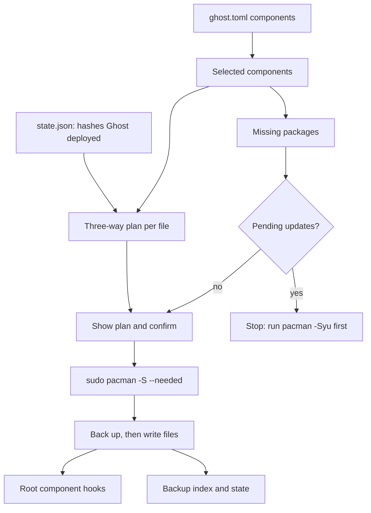

# Architecture

Ghost has two separate execution paths: the desktop loading its configuration, and the Rust CLI that installs that configuration and diagnoses the machine.

## Desktop startup

`hyprland.lua` runs each module as a separate step inside a protected call. A failing step is reported with a Hyprland error notification (`ghost/report.lua`) and the remaining steps still run, so a broken rules file does not remove keybindings or startup programs. If the host loader itself fails, the entry point reports it and loads `hosts/default.lua` directly; only if that also fails do later steps receive an empty profile (no monitors, no environment overrides). If keybindings fail, minimal emergency binds are registered (terminal, launcher, exit). Errors raised while Hyprland loads a module body are additionally listed by Hyprland's own config-error reporting (`hyprctl configerrors`).

Fallbacks are reported, not silent: a host profile that exists but fails to load produces an error notification before `hosts/default.lua` is used, and a missing or failing `split-monitor-workspaces` package produces a warning or error before native workspace selectors are used. A machine with no profile file uses the default profile without a message.

The compositor starts applications, and each application reads its own configuration. The palette TOML files are source assets for a future generator, not a live shared theme service. GTK CSS imports adjacent color files, rofi imports its Rasi colors, and the compositor loads a Lua palette.

## CLI install flow

Reading the diagram: the plan compares each source file, the file on disk, and the hash Ghost recorded when it last deployed that path. That comparison decides between update, `.ghost-new` beside your edit, backup-and-replace, or leaving the file alone. State and the backup index are saved after every file, so an interrupted run can still be restored. `ghost restore` replays the latest backup index in reverse. `ghost doctor` only reads `/sys`, `/proc`, `/etc`, and command output.

`ghost apply` (theme rendering) is not implemented; the palette TOML files are still source assets.

## Files and privileges

The CLI runs as the desktop user and refuses to run as root. User components may only write under `~/`. Root components (`sddm`, `gpu`) may only write absolute system paths, through `sudo install` and `mv`. Their originals are read as the user and backed up into the user's state directory. Packages are installed with `sudo pacman -S --needed`; the CLI never runs a system upgrade, enables services, or edits the bootloader or initramfs.

See [configuration](../getting-started/configuration.md) for host assumptions and [roadmap](../development/roadmap.md) for planned implementation.
